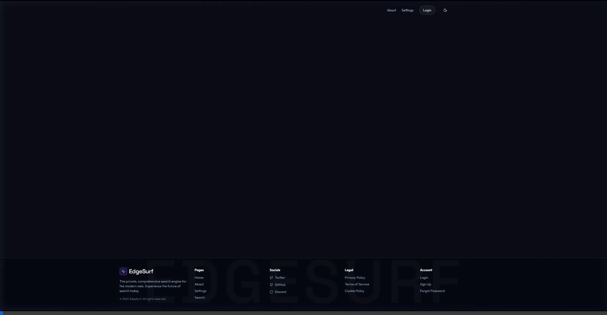
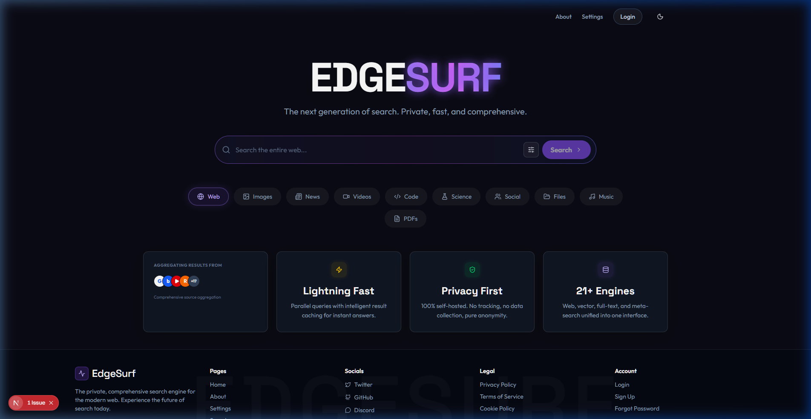
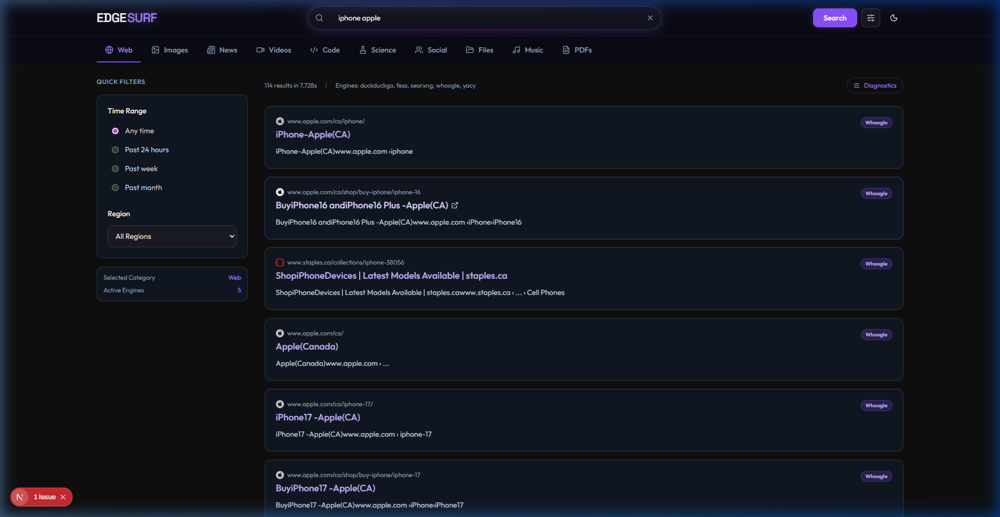
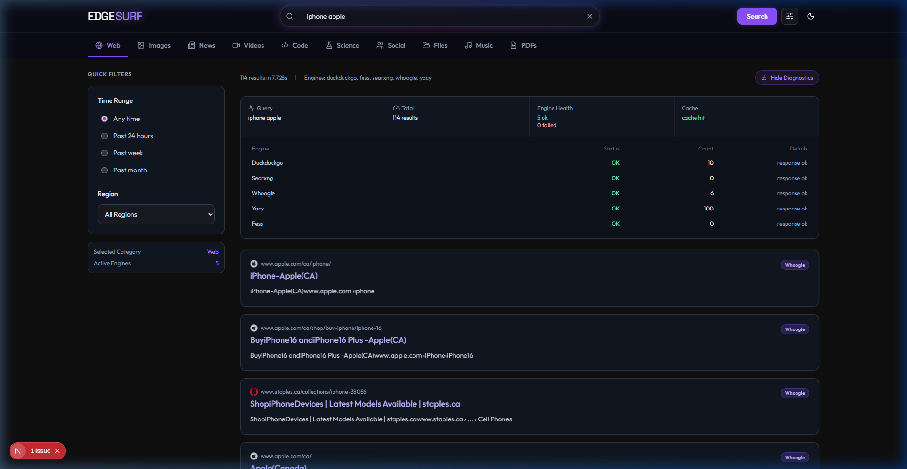
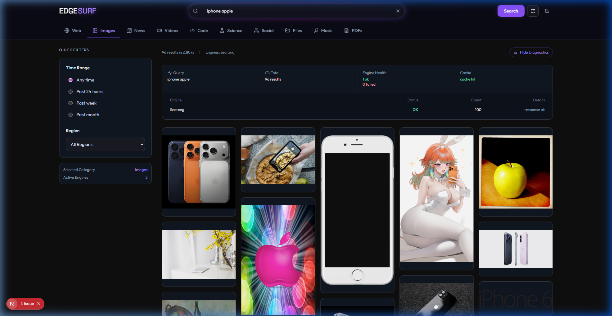
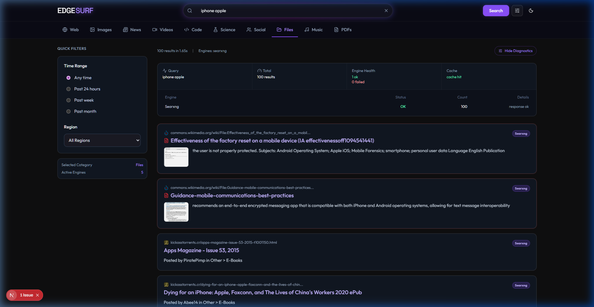

  
  
  <h1>EdgeSurf</h1>
  
<b>( just searchengine )</b>

  

    
    
    
    
     
    
  

  
Navigating the vast expanse of the internet can often feel like searching for a needle in a haystack. <b>EdgeSurf</b> emerges as a quintessential game-changer in this domain. Meticulously engineered to prioritize privacy and speed, this state-of-the-art search platform seamlessly aggregates results across 21+ distinct engines, ensuring that you leave no stone unturned.

---

## 💡 Words of Wisdom

> _"Arguing that you don't care about the right to privacy because you have nothing to hide is no different than saying you don't care about free speech because you have nothing to say."_
>  &mdash; **Edward Snowden**

> _"Privacy is not an option, and it shouldn't be the price we accept for just getting on the Internet."_
>  &mdash; **Gary Kovacs**

---

## ✨ Key Features: What Makes EdgeSurf Unique?

- 🛡️ **Absolute Privacy & Zero Tracking:** 100% self-hosted architecture. No tracking, no data farming, and complete anonymity. Your queries belong to you.
- ⚡ **Lightning-Fast Aggregation:** Bridges the gap between speed and comprehensiveness. Parallel queries with intelligent result caching ensure instant answers.
- 🌐 **21+ Diverse Search Engines:** Web, vector, full-text, and meta-search unified into a single, cohesive interface.
- 🔍 **Transparent Diagnostics:** A built-in diagnostic drawer provides a transparent look under the hood for developers to track engine health, cache efficiency, and precise query timings.
- 🖼️ **Dedicated Media & File Discovery:** Effortlessly pivot your search query to aggregate high-quality visuals, academic PDFs, presentation slides, and raw data files.

  

---

## 💻 Tech Stack

Our robust architecture leverages the best modern tools to ensure speed, stability, and developer satisfaction:

### Frontend

  
  
  
  
  

### Infrastructure & Backend Services

  
  
  

---

## 🎥 Discover EdgeSurf in Action

Witness the sheer speed and comprehensiveness of EdgeSurf as it seamlessly scours the web for _"iphone apple"_ across multiple indexes in real-time. This short demonstration perfectly encapsulates the platform's unparalleled efficiency.

  

---

## 📸 A Glimpse into the Interface

By and large, a picture is worth a thousand words. You can hit the ground running with our highly intuitive and cutting-edge design, fully optimized for a beautiful 16:9 viewing experience.

### 1. The Pristine Home Page

Our landing page offers an immersive, distraction-free gateway to the entire web.

  

### 2. Lightning-Fast Web Search

Experience instantaneous results flawlessly compiled from multiple search indexes—like Whoogle, SearXNG, and DuckDuckGo—without ever compromising your privacy.

### 3. Transparent Diagnostics

For meticulous users and developers alike, the built-in diagnostic drawer provides a transparent look under the hood. Keep track of engine health, cache efficiency, and precise query timings.

  

### 4. Integrated Image Search

Effortlessly pivot your search query to aggregate high-quality visuals and media across numerous backend providers.

### 5. Document & File Discovery

Leave no stone unturned when hunting for academic PDFs, presentation slides, or raw data files through our dedicated Files category.

---

## 🎨 Design Vision & Prototyping

To ensure our abstract vision was translated flawlessly into a tangible reality, we leveraged Figma to establish our overarching design paradigm.

  
    
  

---

## � Our Vision

  

Are you tired of constantly compromising your digital privacy for relevant web results? 🛑 It’s time for a definitive paradigm shift!

We are absolutely thrilled to present **EdgeSurf**—the next generation of search. 🚀 To begin with, it seamlessly bridges the gap between speed and comprehensiveness by aggregating results from over 21 diverse engines. Furthermore, it boasts a state-of-the-art infrastructure that respects your absolute privacy. No tracking. No insidious data farming. Just pure, unadulterated information.

In light of recent worldwide data vulnerabilities, self-hosting a meticulously secure search environment is no longer just an alternative; it is imperative. We truly left no stone unturned while designing this platform. From an immersive 16:9 UI to transparent query diagnostics and dedicated tabs for files and images, it undeniably acts as a breath of fresh air in today's rather cluttered ecosystem.

Whether you are a developer seeking transparency or an everyday user craving speed, you can hit the ground running with EdgeSurf and experience the web exactly as it was meant to be.

---

## 🚀 Multiple Pathways to Innovation: Explore My SaaS Products

 

### 🌊 EdgeSurf: The Ultimate AI Search Engine

<a href="https://github.com/KenanGain/edgesurf-searchengine">View Repository</a>

<table>
  <tr>
    <td>
      
    </td>
    <td>
      
    </td>
  </tr>
  <tr>
    <td colspan="2">
      
<strong>Enter the Ultimate AI Search Engine—because good enough is simply unacceptable.</strong> This ambitious project pulls in over 21 diverse engines for a layered, context-savvy search experience that transcends traditional search boundaries.

      
Built to do more than just “find stuff,” <strong>EdgeSurf</strong> promises to dive headfirst into the internet's abyss and return with gems of wisdom. From web, document, and image retrieval, it’s your self-hosted go-to for precise answers, absolute privacy, and the kind of lightning-fast results that will leave you wondering how you ever managed without it.

      
<em>Check out the full interactive demonstration video at the top of this documentation!</em>

    </td>
  </tr>
</table>

  
<strong>Features and Highlights</strong>

  <table>
    <tr>
      <th>Advanced Capabilities</th>
      <th>Privacy & Architecture</th>
    </tr>
    <tr>
      <td valign="top">
        <ul>
          <li><strong>Aggregated Search</strong>: Compiles results from 21+ indexes including Google, DuckDuckGo, and SearXNG.</li>
          <li><strong>Integrated Media</strong>: Dedicated tabs for discovering raw data files, documents, and high-quality images.</li>
          <li><strong>Transparent Diagnostics</strong>: A built-in drawer to track engine health, cache efficiency, and query timings.</li>
        </ul>
      </td>
      <td valign="top">
        <ul>
          <li><strong>Absolute Privacy</strong>: Zero tracking, zero pervasive data farming. You own your queries.</li>
          <li><strong>Self-Hosted Infrastructure</strong>: Dockerized backend architecture for ultimate control and security.</li>
          <li><strong>Modern Real-Time UI</strong>: Built with Next.js, styled with Tailwind CSS, and optimized for a 16:9 1080p experience.</li>
        </ul>
      </td>
    </tr>
  </table>

 

### 🍁 MapleLawAI: Your Comprehensive Legal Companion

<a href="https://maplelawai.com">View Demo</a>

<table>
  <tr>
    <td>
      
    </td>
    <td>
      
    </td>
  </tr>
  <tr>
    <td colspan="2">
      
<strong>Welcome to 🍁 <a href="https://maplelawai.com">MapleLawAI</a>,</strong> your all-in-one AI-powered legal tool designed to support Canadian citizens, lawyers, immigrants, law students, and small businesses. Imagine a world where legal barriers no longer exist—where access to legal knowledge and services is a right for every Canadian, regardless of their background or financial standing. This is not merely a vision; it is the reality 🍁MapleLawAI is creating.

      
🍁<strong>MapleLawAI</strong> is an avant-garde platform set to revolutionize the legal sector in Canada. Developed for both clients and legal professionals, this platform stands as a beacon of innovation, efficiency, and accessibility. By leveraging the most advanced Large Language Models (LLMs) and a comprehensive vector database containing all Canadian legal documents, MapleLawAI ensures access to the most accurate and up-to-date legal information.

      
The Next.js application, styled with ShadCN Tailwind CSS, offers a seamless and intuitive user experience. Integrated with Clerk for secure authentication and powered by the Vercel AI SDK with edge runtime capabilities, MapleLawAI delivers swift AI responses and reliable performance. Whether researching case law, preparing for court, or seeking legal advice, MapleLawAI serves as a trusted partner.

      
The development does not stop here. MapleLawAI is continually evolving with future features such as a virtual courthouse, where arguments can be presented and a virtual judge delivers justice. The platform will also analyze case law to provide statistics and insightful answers, complemented by comprehensive dashboards and a robust research platform. Additionally, there are plans to expand globally with specialized legal AI tools including Egale Legal AI for the USA, JusticeMate AI for Australia, RedBusLaw AI for the UK, MaoriJusticeAI for New Zealand, and FrankfurtLegalBot for Germany.

    </td>
  </tr>
</table>

  
<strong>Features and Highlights</strong>

  <table>
    <tr>
      <th>Upcoming Features</th>
      <th>Current Features</th>
    </tr>
    <tr>
      <td valign="top">
        <ul>
          <li><strong>Virtual Courthouse</strong>: Present and argue cases in a fully virtual environment with a virtual judge.</li>
          <li><strong>Comprehensive Case Analysis</strong>: Access detailed statistics and insights from extensive case law data.</li>
          <li><strong>Global Expansion</strong>: Introducing specialized legal AI tools for the USA, Australia, UK, New Zealand, and Germany.</li>
          <li><strong>Enhanced Dashboards</strong>: Advanced dashboards for better data visualization and decision-making.</li>
          <li><strong>Research Platform</strong>: A dedicated platform for in-depth legal research and analysis.</li>
        </ul>
      </td>
      <td valign="top">
        <ul>
          <li><strong>Best LLM Models Available</strong>: Utilizes the most advanced language models for accurate legal assistance.</li>
          <li><strong>Comprehensive Vector Database</strong>: Access to a vast repository of Canadian legal documents and resources.</li>
          <li><strong>Secure Authentication</strong>: Integrated with Clerk to ensure reliable and secure user access.</li>
          <li><strong>Next.js Application</strong>: A robust and scalable web application framework for optimal performance.</li>
          <li><strong>ShadCN Tailwind CSS</strong>: Stylish and responsive design for an excellent user experience.</li>
          <li><strong>Vercel AI SDK & Edge Runtime</strong>: Delivers fast AI responses and efficient processing.</li>
          <li><strong>Continuous Updates</strong>: Regular enhancements and feature additions to keep the platform cutting-edge.</li>
        </ul>
      </td>
    </tr>
    <tr>
      <td colspan="2">
        <strong>Quick Start:</strong> Visit <a href="https://maplelawai.com">MapleLawAI</a> today to revolutionize your legal interactions. Whether seeking legal advice, conducting research, or managing a legal practice, MapleLawAI provides the necessary tools and knowledge.
      </td>
    </tr>
  </table>

 

### 📄 Document Whispers: AI Answers, Knowledge Revealed

<a href="https://documentwhispers.com">View Demo</a>

<table>
  <tr>
    <td>
      
    </td>
    <td>
      
    </td>
  </tr>
  <tr>
    <td colspan="2">
      
<strong>Welcome to 'Document Whispers',</strong> the future of document interaction. This modern web application transforms how you engage with your PDFs by allowing you to upload documents and chat directly with them. Powered by the cutting-edge Vercel AI SDK, 'Document Whispers' provides blazing-fast AI responses, making it your go-to tool for quick answers to assignments and research inquiries.

      
Our platform not only lets you read documents as you interact with them, but also ensures that your queries are thoroughly analyzed to provide high-quality, well-researched answers. Leveraging the largest and most advanced language models, our generative AI digs deep into your questions, offering precise and insightful responses.

      
Built on robust serverless technology for seamless performance and protected by Clerk for top-tier authentication, 'Document Whispers' is continually evolving. Stay tuned for more innovative features that will redefine your document handling experience!

    </td>
  </tr>
</table>

  
<strong>Features and Highlights</strong>

  <table>
    <tr>
      <th>Upcoming Features</th>
      <th>Features</th>
    </tr>
    <tr>
      <td valign="top">
        <ul>
          <li><strong>Multilingual Support</strong>: To help users worldwide engage with their documents.</li>
          <li><strong>Mobile Application</strong>: Access Document Whispers on the go with our upcoming mobile app.</li>
          <li><strong>Enhanced Security Measures</strong>: Additional layers of security to protect your sensitive information.</li>
        </ul>
      </td>
      <td valign="top">
        <ul>
          <li><strong>AI-Powered Interaction</strong>: Engage with your documents through natural language conversations.</li>
          <li><strong>Real-Time Processing</strong>: Upload and start conversing with your documents without any delay.</li>
          <li><strong>Advanced Query Understanding</strong>: Utilizes the latest in AI technology to comprehend and respond to inquiries accurately.</li>
          <li><strong>Serverless Architecture</strong>: Ensures high availability and scalability without the hassle of infrastructure management.</li>
          <li><strong>Secure Authentication</strong>: Integrates with Clerk to provide reliable and secure access to the platform.</li>
          <li><strong>Continuous Updates</strong>: Regular updates to add new features and enhance the user experience.</li>
        </ul>
      </td>
    </tr>
    <tr>
      <td colspan="2">
        <strong>Quick Start:</strong> Visit <a href="https://documentwhispers.com">Document Whispers</a> to start transforming your PDF interactions today. Explore the possibilities of engaging with your documents in a way you never thought possible.
      </td>
    </tr>
  </table>

 

## ⏳ Coming Soon...

  

### 🚀 Super GPT: The AI Overachiever You Didn’t Know You Needed

<strong>Super GPT</strong> is here to unite the world’s top LLMs, because why settle for one when you can have them all? Currently in development, this powerhouse is over-prepared to handle web searches, document interrogation, and even video analysis. If you need something found, explained, or overanalyzed, Super GPT has you covered.

Mixing small and large language models like a tech smoothie, Super GPT doesn’t just answer questions; it contemplates existence. With a sleek UI that practically <em>whispers</em> “futuristic,” Super GPT is setting a gold standard in AI that we’re almost certain no one actually asked for—but everyone will soon need.

---

## 🤝 Let's Connect!

I'm always open to discussing new projects, creative ideas, or opportunities to be part of your visions. Feel free to reach out to me through any of the platforms below:

|                                                                   Kenan Gain                                                                    |                                                                                                YouTube                                                                                                |                                                                                                 Instagram                                                                                                 |                                                                                                        LinkedIn                                                                                                         |                                                                                    Facebook                                                                                     |
| :---------------------------------------------------------------------------------------------------------------------------------------------: | :---------------------------------------------------------------------------------------------------------------------------------------------------------------------------------------------------: | :-------------------------------------------------------------------------------------------------------------------------------------------------------------------------------------------------------: | :---------------------------------------------------------------------------------------------------------------------------------------------------------------------------------------------------------------------: | :-----------------------------------------------------------------------------------------------------------------------------------------------------------------------------: |
|  |  |  |  |  |

|                                                                                            Twitch                                                                                             |                                                                           Twitter (X)                                                                           |                                                                                                              Reddit                                                                                                              |                                                                                    Discord                                                                                     |                                                                                   GitHub                                                                                    |
| :-------------------------------------------------------------------------------------------------------------------------------------------------------------------------------------------: | :-------------------------------------------------------------------------------------------------------------------------------------------------------------: | :------------------------------------------------------------------------------------------------------------------------------------------------------------------------------------------------------------------------------: | :----------------------------------------------------------------------------------------------------------------------------------------------------------------------------: | :-------------------------------------------------------------------------------------------------------------------------------------------------------------------------: |
|  |  |  |  |  |
